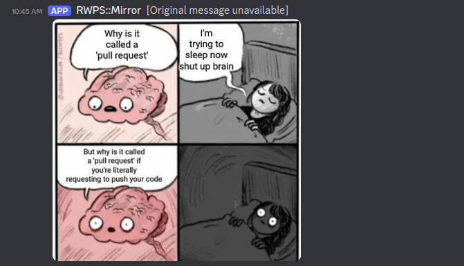
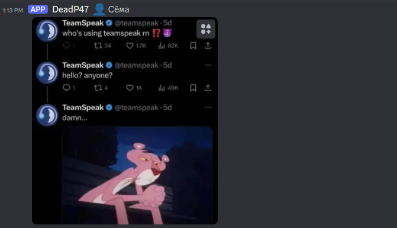
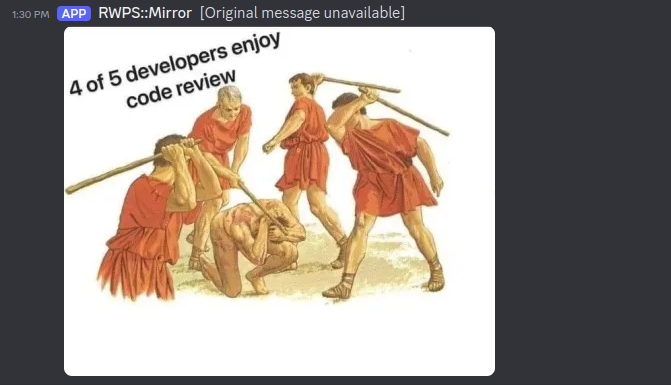

# Reposter
Original goal was to simply forward messages from Telegram to Discord.
<br/>
Then I realised that it would be cool if it was possible to forward content from other sources. And maybe even other destination.

## Little about design choices
```
./authorizer is simple helper app for authorizing in telegram, used as initContainer in kubernetes
```

```
./reposter is dummy spring app for actual discord webhook executing, probably will be replased in future 
```

## Example Usage

<br/>

<br/>


## Future goals
Add content translation